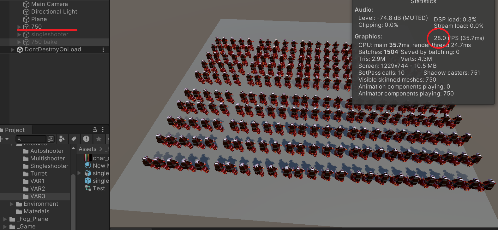
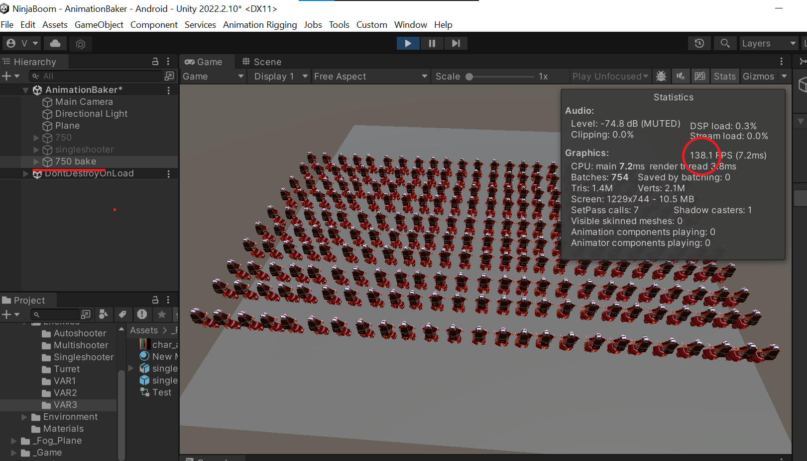

<!DOCTYPE html>
<html>
<head>
</head>
<body>
    
  # AnimationBakerTemplates
  the free mini asset for baking animations
  Asset work with model that had only one maderial (renderer object) so for example model and weapon may has unique models
  

    
    
  

</body>
</html>
